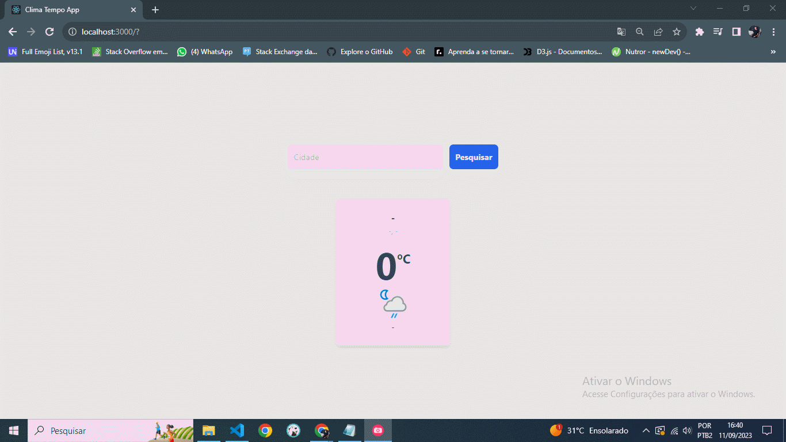

# 🌤 Clima Tempo

Projeto de criação de uma aplicação com REACT que acessa a API real 'Weather' e renderiza na tela alguns dados do clima da Cidade pesquisada. JavaScript, CSS e Tailwind.

## Pré-requisitos

Visual Studio Code

## Uso
Clone o Projeto no GitHub:
https://github.com/1andersonmotta/reactClimaTempo
Abra o projeto com Visual Studio Code e execute:  
# Instale os pacotes de dependencia do projeto:  
$ npm install  

# Execute a aplicação:  
$ npm start

- A Aplicação deverá abrir em seu navegador e estará pronta para uso.

## 🛠 Ferramentas

- [REACT](https://react.dev/)
- [JavaScript](https://developer.mozilla.org/pt-BR/docs/Web/JavaScript)
- [CSS](https://developer.mozilla.org/pt-BR/docs/Web/CSS)
- [TAILWIND](https://tailwindcss.com/docs/guides/create-react-app)

## Contribuição

Se você tem alguma Sugestão enviar para devandersonmotta@gmail.com com o assunto: "contribuição clima tempo" ou entre em contato pelo Linkedin.

## Licença

MIT

## ✉ Contato

email: devandersonmotta@gmail.com

linkedin: www.linkedin.com/in/anderson-motta-96b138235
---

## 💡 Objetivo

Praticar os conceitos do REACT, TAILWIND e adquirir conhecimento. 

